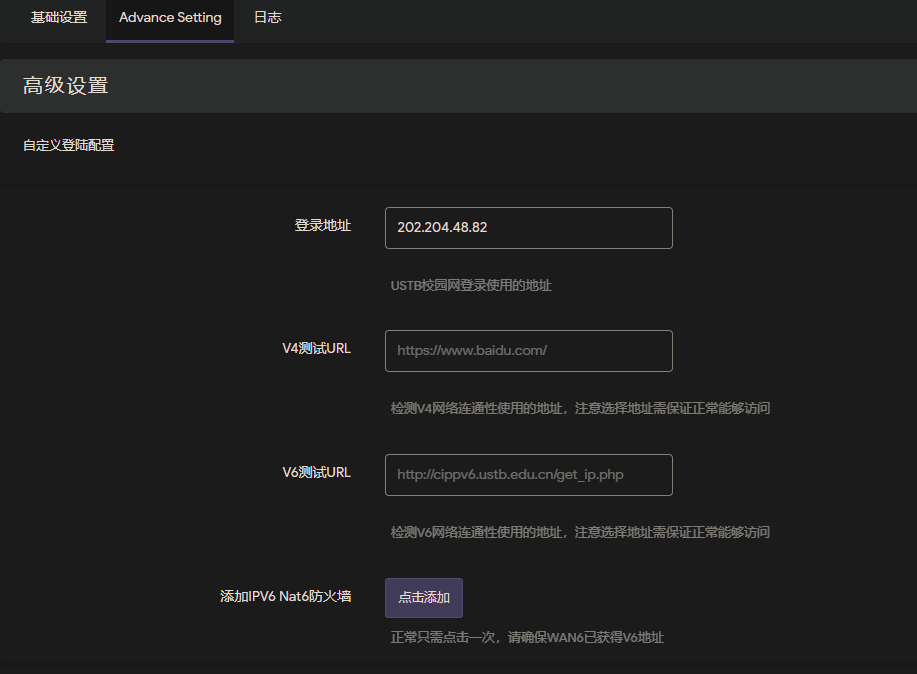

# luci-app-ustb
北京科技大学(USTB)校园网自动登录程序    
支持ipv6，支持日志查看
安装完之后建议重启路由器

#### To do:
- [x] 基本自动连接
- [x] 插件状态显示
- [x] 自动设置IPV6 nat6
- [x] 自定义登录地址、检测地址等高级设置
- [ ] 低费用邮件提醒

代码借鉴了[Lean](https://github.com/coolsnowwolf/lede)的**luci-app-unblockmusic、luci-app-vlmcsd**
